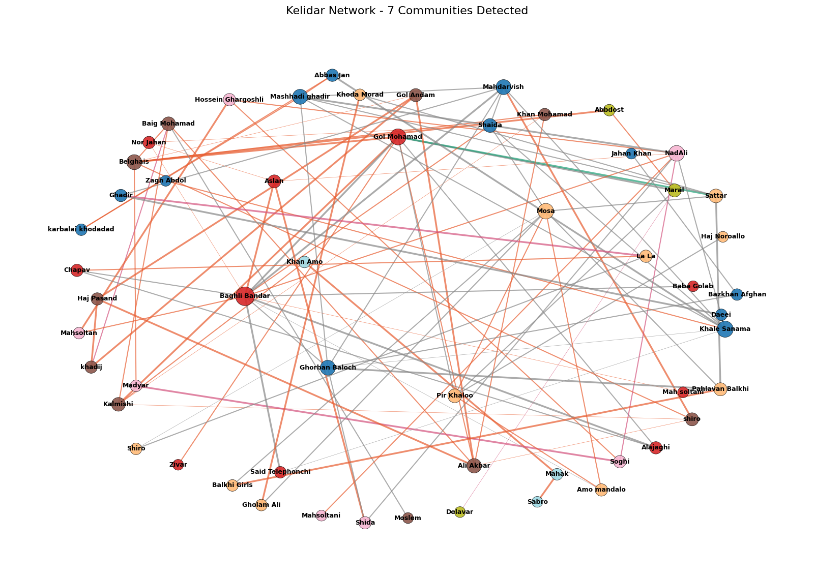

پروژه تحلیل شبکه شخصیت‌های رمان کلیدر، جلد اول

در این پروژه شبکه روابط شخصیت‌های جلد اول رمان کلیدر اثر محمود دولت‌آبادی را با استفاده از پایتون تحلیل کرده ایم.
 داده‌های پروژه بر اساس داستان کتاب عبارت است از:
40 شخصیت‌ها، که با ۴۰ گره آن ها را نمایش داده ایم
50 رابطه، که با بیش از 50 یال نمایش داده شده اند، تعداد یال ها بیشتر از 50 تا است زیرا برخی از افراد بیش تر از یک نوع رابطه دارند. 
انواع روابط موجود در گراف: خانوادگی، عاشقانه، اجتماعی، متحد، دشمن

در تحلیل این گراف از ابزارهایی   Python ، NetworkX، Pandas و Matplotlib استفاده کرده ایم.

نتایج تحلیل شبکه ارتباطی شخصیت های داستان کلیدر:

بررسی معیارهای مرکزیت نشان می دهد که 
بلقیس، با بالاترین Degree Centrality (0.28) و Betweenness Centrality (0.669)  محوری‌ترین شخصیت داستان است، یعنی ارتباط افراد  مختلف داستان با یکدیگر بیشتر از طریق بلقیس است و حذف او افراد را از هم دور می کند. 
گل‌محمد با Degree Centrality (0.20) شخصیت اصلی داستان است که بیشتر ارتباطات به او ختم می شود و مدیار با Betweenness بالا رابط بین دو دنیای داستان است، اگر مدیار نباشد ارتباط قسمتی از شخصیت ها با داستان بسیار کم رنگ یا قطع می شود.

تحلیل ساختار شبکه نشان می دهد که 
چگالی گراف 0.01 است، یعنی فقط یک درصد از ارتباط های ممکن در شبکه شکل گرفته اند پس شبکه بسیار تنک است، اگر روابط کامل بودند چگالی یک بود.
میانگین کوتاه‌ترین مسیر در گراف 4.6 است که این یعنی برای رسیدن از یک گره تا گره دیگر 4 یا 5 گام کافی است، مانند اکثر شبکه های دنیای واقعی اما قطر گراف 11 است و میانگین ضریب خوشه‌بندی 0.2 است پس می توان نتیجه گرفت که احتمالا در شبکه چند نقطه دور افتاده از هم وجود دارد، یعنی چند نفر هستند که ارتباط آن ها با هم بسیار کم است و برای رسیدن به یکدیگر مسیر زیادی را باید طی کنند، تقریبا دو برابر میانگین.

بررسی کامیونیتی‌ها (اجتماع ها) نشان می دهد که شخصیت های جلد اول داستان کلیدر در این پنج گروه دسته بندی می شوند:
1. گل‌محمد و خانواده مارال
2. بلقیس و برادرها
3. ماه‌سلطانی، نادعلی، صغی
4. باقلی‌بندر و خانواده‌اش
5. خان‌عمو، ماهک، صبرو

گره های بحرانی یعنی شخصیت‌هایی که اگه حذف بشوند شبکه از هم می‌پاشد عبارتند از :
گل‌محمد، کلمیشی، بلقیس، مارال، خاله صنما، باقلی‌بندر، نادعلی

مهم‌ترین یال شبکه، یال ارتباطی  گل‌محمد ↔ باقلی‌بنداراست Edge Betweenness (0.185) مهمترین پل بین دو دنیای داستان را ایجاد کرده است. بررسی مفهومی داستان هم نشان می دهد که ارتباط بین گل محمد و باقلی بندار در واقع ارتباط بین فضای خانوادگی و فضای کار و اقتصادی است.
etweenness (0.185) مهمترین پل بین دو دنیای داستان را ایجاد کرده است.
تصویر گراف:

